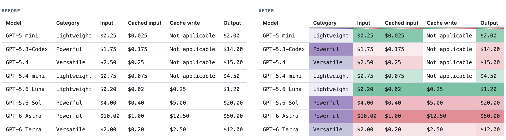
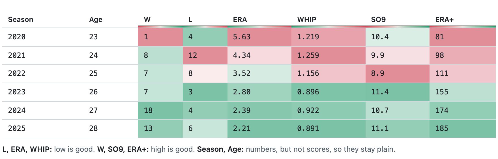
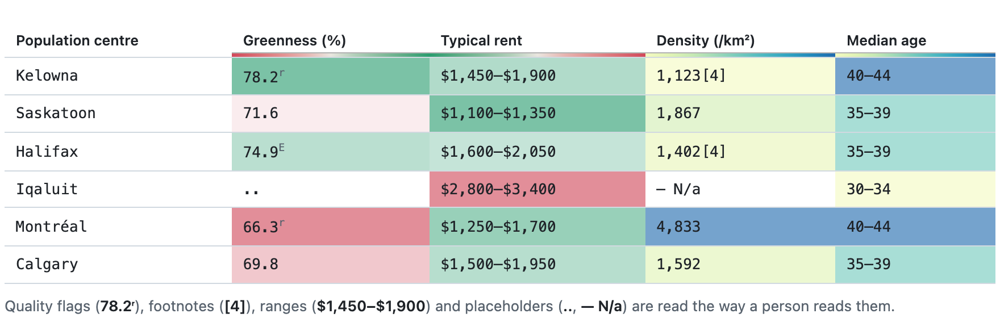
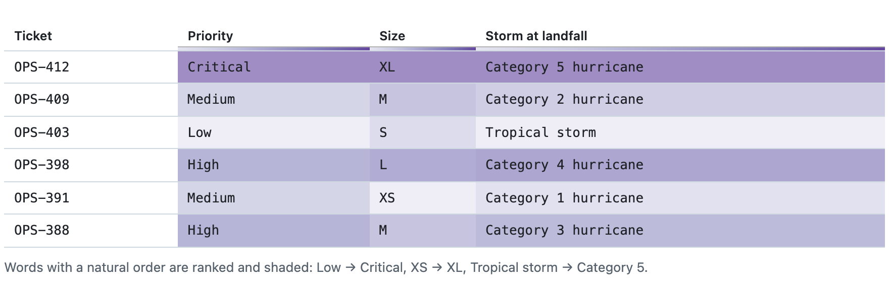
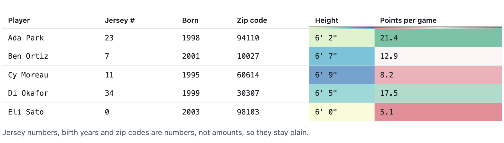

# Practical Data

Conditional formatting for every table on the web, with the direction figured
out for you. A Chrome extension that shades the comparable columns of any HTML
table, so the better and worse rows show without reading every cell.

**Demo:** https://practicaldata.dev ·
**Chrome Web Store:** coming soon ([load it unpacked](#install) until then)

<picture>
  <source media="(prefers-color-scheme: dark)" srcset="docs/media/hero-dark.png">
  
</picture>

> **Needs an API key.** Shading is judged by a small decision model:
> [TypeSafe's Jev](https://typesafe.ai) by default, or Cloudflare's Clef. A
> page costs 0.06–0.2¢ on the test corpus (15k–40k input tokens at Jev's
> $0.042 per million); unchanged tables aren't judged twice. **Table text leaves your browser:** headers, sample values and a few
> rows of each table you scroll near go to the provider you choose. Turn sites
> off, or switch to "only sites I turn on", for pages with private data.
> See the [privacy policy](PRIVACY.md).

### Knows when a big number is bad

Price, ERA and errors are lower-is-better; wins and strikeouts are
higher-is-better. When a column has a better direction, green is the better
end.

<picture>
  <source media="(prefers-color-scheme: dark)" srcset="docs/media/direction-dark.png">
  
</picture>

### Reads messy cells

Footnotes, quality flags, ranges, units, clock durations and placeholders are
parsed, not skipped. Ranges are shaded by their midpoint; `2:59` reads as one
less than `3:00`, while a `7:05` start time is left alone. (Example table.)

<picture>
  <source media="(prefers-color-scheme: dark)" srcset="docs/media/messy-dark.png">
  
</picture>

### Ranks words, not just numbers

Labels with a natural order are put in order and shaded: Low → Critical,
XS → XL, Tropical storm → Category 5. (Example table.)

<picture>
  <source media="(prefers-color-scheme: dark)" srcset="docs/media/words-dark.png">
  
</picture>

### Leaves identifiers alone

Jersey numbers, years, zip codes and model names are numbers or labels, not
amounts, so they stay plain. (Example table.)

<picture>
  <source media="(prefers-color-scheme: dark)" srcset="docs/media/plain-dark.png">
  
</picture>

### And

- **Reads tables both ways**: when rows are the measures and columns the
  items (benchmarks × models), each row gets its own scale.
- **Shares scales across tables** when the same column appears in several of
  them, so colors compare page-wide.
- **Leaves totals out** of the scale ("World", "Total").
- **Uses log scales** when values span orders of magnitude.
- **Fits the page**: separate light and dark palettes, chosen from each cell's
  real background (including `oklch()` colors), with text kept at 5:1
  contrast or better.
- **Shades only what the model is fairly sure about** (≥ 0.7), and judges
  tables as they scroll into view. Unchanged tables aren't judged twice.

Hover a shaded header for its scale. Hover a table to switch it between
columns and rows, or hide its shading; those choices last for the browser
session. The toolbar popup turns a page or a whole site off; <kbd>⌥⇧H</kbd>
toggles the current page.

Sites that color their own tables can opt out with
`<meta name="practical-data" content="off">`; the demo site does.

## Install

**From the Chrome Web Store**: coming soon. Once installed, paste a TypeSafe
API key on the options page and select **Test**.

**Unpacked**, from source:

```sh
npm install
npm run build
```

1. Open `chrome://extensions` and turn on **Developer mode**.
2. Select **Load unpacked** and choose `dist/`.
3. On the options page, paste a TypeSafe API key. Select **Test** to check it.

## Verify

| Command | What it proves | Network |
| --- | --- | --- |
| `npm test` | Parsing, profiling, ordering, color math, contrast, and judge composition against a scripted model | None |
| `npm run eval` | Model judgments on 19 pages against hand labels in `fixtures/expectations.json` | Jev for new questions only; answers are recorded |
| `npm run eval -- --offline --strict` | The same, replayed from `fixtures/recordings/`; fails on any undocumented mismatch | None |
| `npm run e2e -- --offline` | The built extension in Chromium: every page finishes, tables below the fold wait until scrolled near, every column paints, text keeps 5:1 contrast, the better end is greener, header underlines render without changing column widths, collapsed tables get judged once opened, shading follows cells rewritten in place, hidden-table choices survive tables being inserted above, the page's own style changes survive turning shading off, `oklch()` dark backgrounds are read as dark, in-app navigation starts fresh, the per-table controls and popup work, and turning shading off restores the original markup | None (API calls are replayed) |
| `npm run e2e -- --live` | The same against the real sites in `fixtures/live/sources.json`, with live Jev calls | Yes |
| `npm run check` | All offline gates in sequence | None |

Screenshots from each e2e run go to `artifacts/screens/`.

### What the scores mean

`fixtures/expectations.json` holds hand labels for 155 columns on 19 pages,
out of about 950 columns those pages contain. Unlabeled columns are mostly
ones nobody would shade either way (names, notes, links) plus a few genuinely
ambiguous ones. The labels and the confidence thresholds were written against
these same pages, so the scores below are a **regression check**: they catch
changes that break known-good behavior. They are not an accuracy estimate
for pages the extension hasn't seen. The offline replay also tests the code
against recorded answers, not the model itself; run `npm run eval` without
`--offline` to ask the model again.

Current (Jev 1.13):

```
color / don't color   155 of 155 labeled columns
direction              74 of 74
log vs linear           5 of 5
ordinal order          10 of 11
rows vs columns         7 of 7 labeled tables
aggregate rows          2 of 2
shared scales           3 of 3
```

The one miss is documented in `expectations.json` under `$known`: Scryfall's
single-letter rarity codes (C/U/R/M). Jev ranks `M` (mythic) below `U` and `R`.
Spelled-out rarities order correctly.

To compare providers, run `node scripts/eval.ts --provider clef` with
`CLOUDFLARE_ACCOUNT_ID` and `CLOUDFLARE_API_TOKEN` set.

## Demo site

`demo/` holds a static page that shows real tables from the corpus, painted
by the extension's own extractor and painter. Colors come from judgments the
pipeline actually produced, never from hand-written styles. `/palettes.html`
compares every palette on the same tables in light and dark.

| Command | What it does |
| --- | --- |
| `npm run demo` | Builds the extension, regenerates `demo/data.json` (replaying recorded answers), and writes `site/` with a downloadable zip of the extension |
| `npm run deploy` | Builds the demo and deploys `site/` to Cloudflare Workers static assets (`wrangler.jsonc`) |
| `node scripts/readme-media.ts` | Regenerates the README images in `docs/media/` (light and dark) from `docs/media-src/cards.html` |
| `node scripts/shoot-demo.ts [url]` | Screenshots the demo in light, dark, desktop, and phone, and reports page errors |
| `npm run package` | Builds `release/practical-data-<version>.zip` for the Chrome Web Store |

To see why a column on any page was or wasn't colored, run
`node scripts/explain-url.ts <url>`.

## Fixtures

- `fixtures/live/`: saved HTML from GitHub Docs, Baseball-Reference,
  Wikipedia, Scryfall, and MTGGoldfish.
- `fixtures/synthetic/`: handmade traps: jersey numbers, zip codes, birth
  years, a totals row, rowspan and colspan headers, signed values, a dark
  theme, and two tables that must share a scale.
- `fixtures/snapshots/`: what the extractor sees on each page. Regenerate
  with `npm run snapshot` after you change `src/dom/extract.ts`.
- `fixtures/recordings/`: recorded model answers keyed by the SHA-256 of each
  request body. A changed question produces a new key, so stale answers are
  never replayed.

## Layout

```
src/core/      Pure: cell parsing, column profiling, pairwise ordering, color scales, contrast-safe tints
src/decide/    Effect: DecisionModel service (Jev, Clef), question builders, the judgePage program
src/dom/       Table extraction (span-aware grid) and D3 painting
src/ext/       Content script, service worker, options page, settings
scripts/       build, snapshot, eval, e2e, screenshot helpers, question-design probes
```

Tables are judged only once they come within about a screen of the
viewport, up to 200 per page. Scrolling down a long page judges the rest as
they approach.

API keys live in `chrome.storage.local`. The extension's own pages (options,
popup) and its service worker read them; content scripts never do, and web
pages can't reach extension storage at all. The worker makes every model call
from content-script requests: content scripts ask it whether a page is on,
send it text snapshots of nearby tables, and receive judgments. Answers are
cached in `chrome.storage.local` (capped, oldest evicted). Only the
extension's own pages and content scripts can message the worker.

See [docs/decisions.md](docs/decisions.md) for how the questions are designed
and why.

## License

[MIT](LICENSE). The pages saved in `fixtures/live/` belong to their
publishers and are included, trimmed to their tables, only as test inputs;
see [fixtures/NOTICE.md](fixtures/NOTICE.md).
